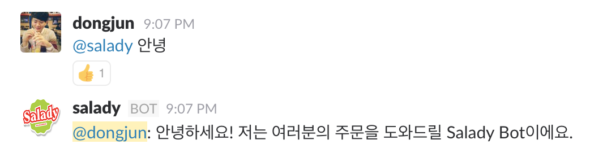
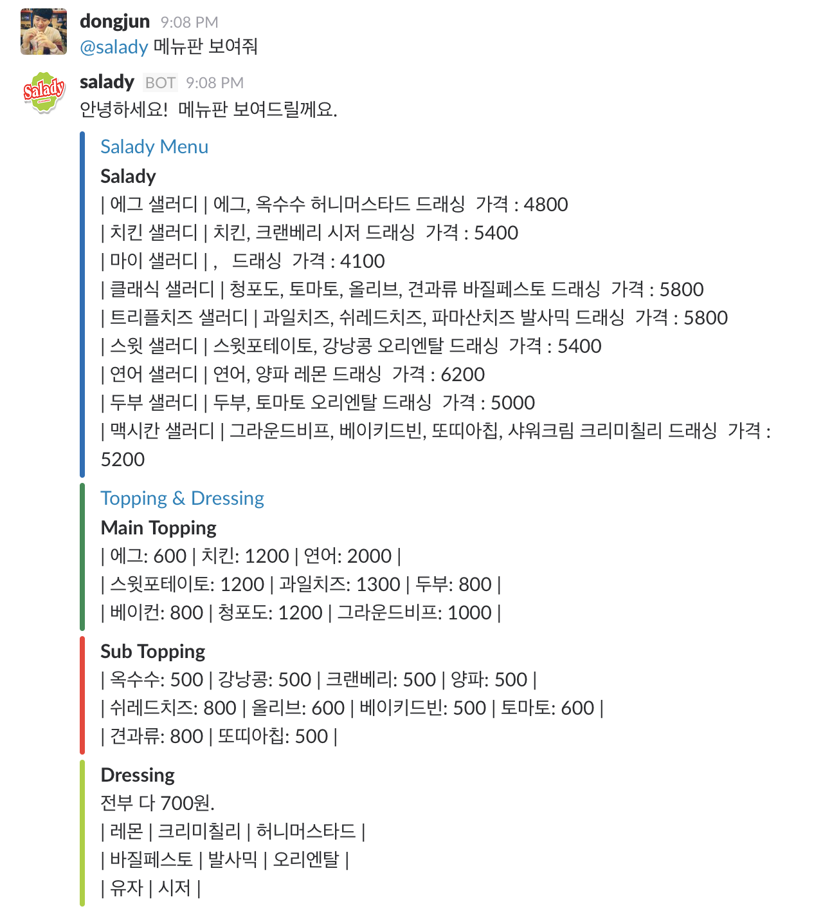
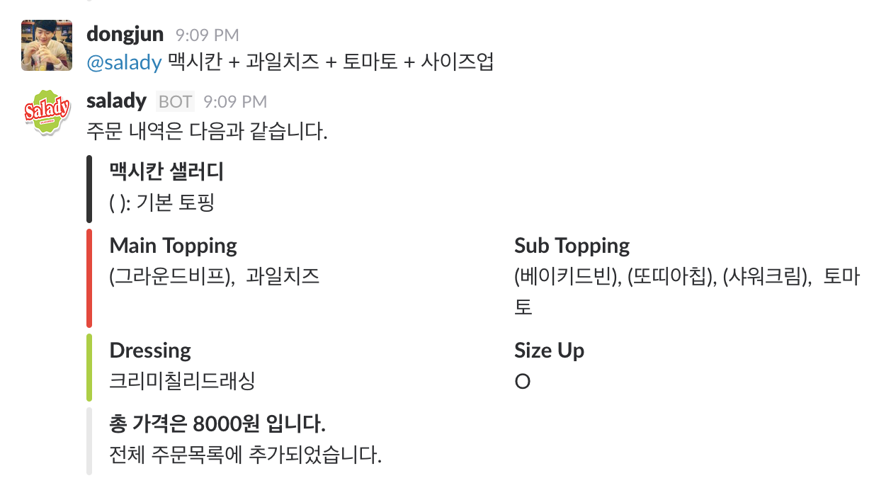
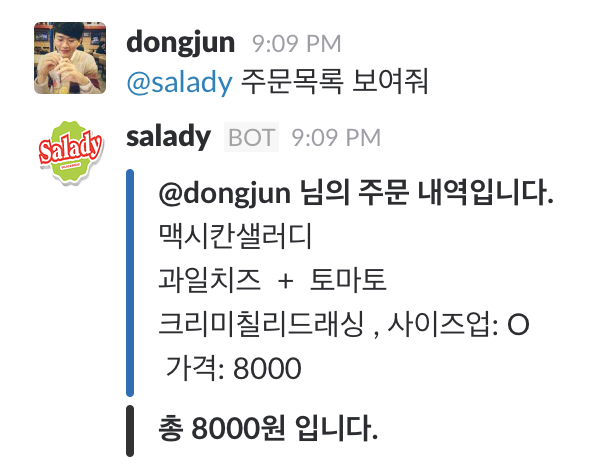

# Salady Bot

샐러디를 시켜먹는 스타트업들을 위한 Slack Bot.

## Prerequisites

- Python 3
- [slackbot library](https://github.com/lins05/slackbot)

## Plugins

- [Basic](#basic)
- [Salady](#saldy)

## Basic

1. 인사

	**키워드**: @salady 안녕 

	

## Salady

1. 메뉴

	**키워드**: @salady 메뉴

	

2. 주문

	**키워드**: @salady 주요샐러디 + 옵션 + 옵션 + ...

	

3. 주문목록

	**키워드**: @salady 주문목록

	
